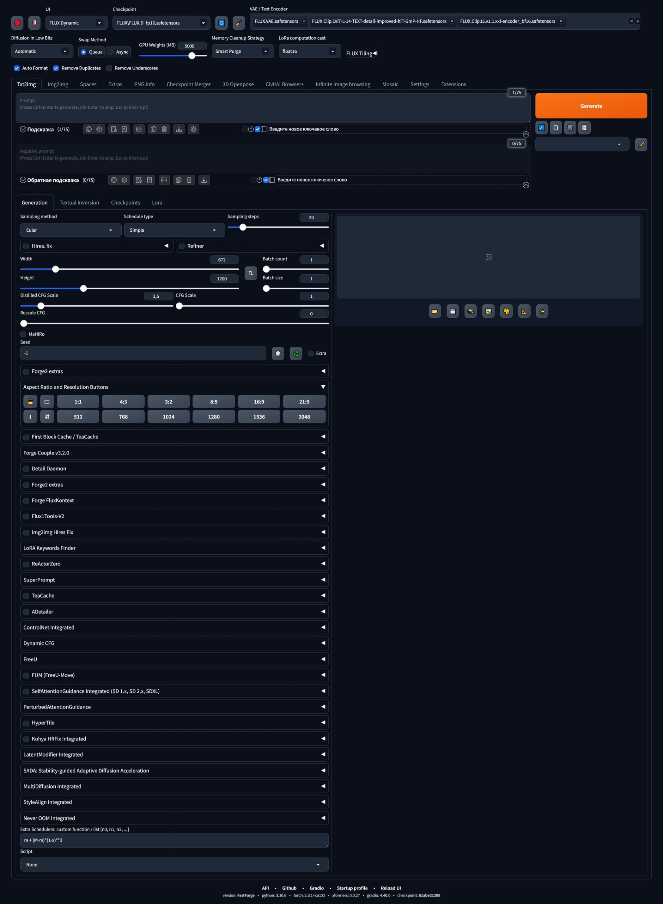

# 🚀 FastForge StableDiffusion WebUI

  🟢 <a href="https://github.com/LeeAeron/stable-diffusion-webui-fastforge"><strong>Torch 2.3.1 CUDA 12.1</strong></a> &nbsp;&nbsp;|&nbsp;&nbsp;
  🔵 <a href="https://github.com/LeeAeron/stable-diffusion-webui-fastforge/tree/py312-torch271-cu128"><strong>Torch 2.7.1 CUDA 12.8</strong></a> &nbsp;&nbsp;|&nbsp;&nbsp;
  🟠 <a href="https://github.com/LeeAeron/stable-diffusion-webui-fastforge/tree/py312-torch280-cu128"><strong>Torch 2.8.0 CUDA 12.8</strong></a>

**FastForge** is a custom build of the Stable Diffusion WebUI, designed for maximum performance—especially on systems with limited VRAM.

## 🔧 Key Differences from Official Forge WebUI

- optimized for all nVidia GPUs, including low-VRAM setups
- main `.bat` menu with extended options for model installation and more
- integrated extensions, ready to use out of the box
- reconfigured core settings and generation parameters
- enhanced UI profiles with pre-defined presets
- added useful features and stability improvements
- no memory overflow issues
- advanced memory control
- Flux.1 Tools and Flux.1 Kontext support out-of-box
- possibility to generate very big resolutions without large VRAM

> The goal: preserve Forge’s native simplicity while adding powerful features that work immediately—**just install, launch, and create.**

---

## 🖥️ Installing FastForge

> ⚠️ Supported only on **Windows 10/11**

### ✅ Supported Models

- SD1–3, SDXL, PONY, Illustrious  
- Flux.1: Dev, Schnell, GGUF  
- Flux.1 Kontext: Dev, Schnell, GGUF  
- Chroma: Dev, Schnell, GGUF  
- Flux.1 Tools: Redux, Canny, Depth, Fill

### 📦 Installation Steps

- Use the **one-click installation package** (includes Git and Python)
- Remaining dependencies (PyTorch, modules) will auto-download on first launch

👉 [Download the latest archive (Python 3.10.6 PyTorch 2.3.1 CUDA 12.1 / Python 3.12.7 PyTorch 2.7.1 CUDA 12.8 / Python 3.12.7 PyTorch 2.8.0 CUDA 12.8)](https://github.com/LeeAeron/stable-diffusion-webui-fastforge/releases)

After downloading:

1. Extract the archive. Run START.bat  
2. Run `Update` entry from .bat menu to update  
3. Run `START.bat` to launch WebUI

---

## 📋 Main `.bat` Menu — 11 Options

1. Launch FastForge WebUI in normal mode (GTX-RTX20xx-40xx)
2. Launch FastForge WebUI with disabled Xformers (RTX50xx mode)
3. Download upscale models (Aria downloader + popular models)  
4. Install additional aDetailer models  
5. Install NF4v2 model (by lllyasviel)  
6. Install Flux.1 Kontext models [¹]  
7. Install Flux.1 VAE and CLIP encoders, plus Chroma VAE [⁴]  
8. Install Flux.1 models for FluxTools: Canny, Fill, Depth [²]  
9. Install prompt translation extension (offline model)
10. Download and install CalrityHD upscale img2img model (JaggernautSD)
11. Update FastForge from Git

> **Notes:**  
> [¹] Kontext supports fp8/fp16/GGUF versions  
> [²] Redux uses Flux.1 models: NF4, Dev GGUF, Schnell, etc.  
> [³] Docker users: menu not available—use `webui-user.bat`  
> [⁴] Chroma supports fp8/fp16/GGUF

📄 [View Changelog](https://github.com/LeeAeron/stable-diffusion-webui-fastforge/blob/main/CHANGELOG.md)  
📁 [Additional repositories used in build](https://github.com/LeeAeron/stable-diffusion-webui-fastforge/blob/main/additional_repositories_inside.md)

---

## ⚙️ NVIDIA GPU Support

FastForge supports GTX and RTX cards, including RTX 20xx–50xx. Special notes:

- **GTX-RTX20xx-40xx series** run available by Main Menu entry #1
- **RTX 50xx series** run available by Main Menu entry #2 
  ➤ NOTE: **RTX50xx series** must be installed with **CU128 releases**!

---

## ⚙️ Pre-Setup enviroment.

- Open env_normal.bat or env_rtx50.bat file with notepad/notepad+ app.
- Setup external folders for models if it's needed, as you've made this in webui-user.bat.
➤ NOTE: env_rtx50.bat file specified for **RTX50xx series** series cards run.

---

## 📥 Additional Models (via `.bat` Menu)

| Model Name             | Download Link                                                                |
|------------------------|------------------------------------------------------------------------------|
| Flux.1 Dev NF4 v2      | https://huggingface.co/lllyasviel/flux1-dev-bnb-nf4                          |
| Flux.1 Dev fp8         | https://huggingface.co/datasets/LeeAeron/flux_controlnet                     |
| Flux.1 VAE & CLIP      | https://huggingface.co/datasets/LeeAeron/flux_vae_encoders                   |
| Offline Translator     | https://huggingface.co/datasets/LeeAeron/offline_translate_model             |
| Kontext fp16           | https://huggingface.co/black-forest-labs/FLUX.1-Kontext-dev/tree/main        |
| Kontext fp8            | https://huggingface.co/6chan/flux1-kontext-dev-fp8/tree/main                 |
| Kontext GGUF           | https://huggingface.co/QuantStack/FLUX.1-Kontext-dev-GGUF                    |
| Chroma fp8             | https://huggingface.co/Clybius/Chroma-fp8-scaled                             |
| Chroma fp16            | https://huggingface.co/lodestones/Chroma                                     |
| Chroma GGUF            | https://huggingface.co/silveroxides/Chroma-GGUF                              |

---

## 📺 FluxTools v2 — Beginner Guide

  

---

## 📺 Flux.1 Kontext — Beginner Guide

